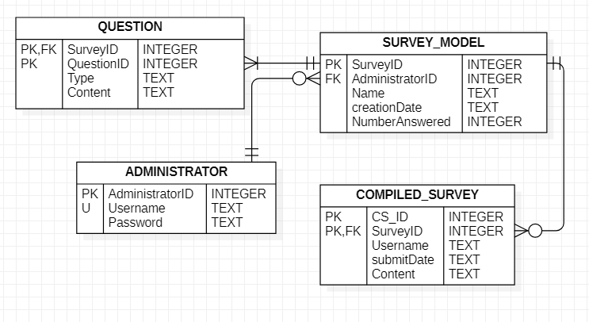
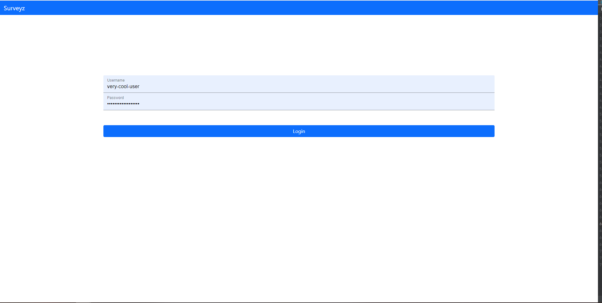
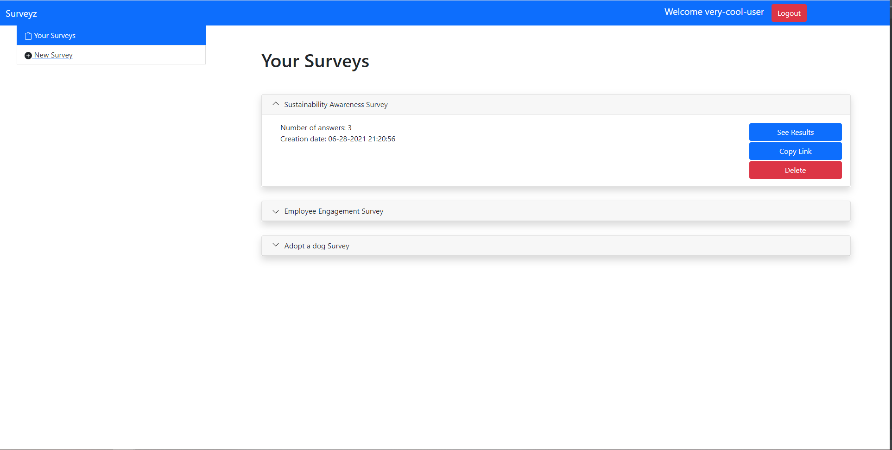
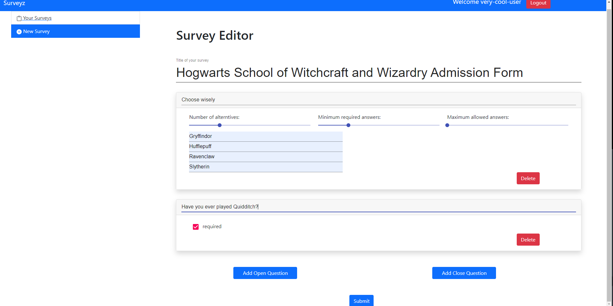
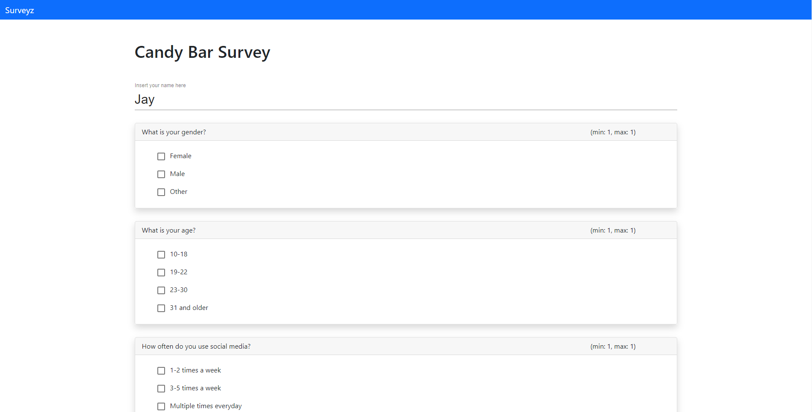

# Exam #1: "Surveyz"

## Student: s292515 RIGGIO MARCO

## React Client Application Routes

- Route `/`: home page of the application. It contains the list of created surveys
- Route `/login`: login page. Most of the pages redirect here if not authenticated
- Route `/survey/:surveyID`: page where the survey with a given ID can be filled and submitted params (surveyID: the ID
  of the survey)
- Route `/survey/:surveyID/result/:resultID`: 'page where it's possible for the owner of the survey to consult the
  submitted forms params (surveyID: the ID of the survey, resultID?: ID of the filled survey, relatively to the
  surveyID)
- Route `/new-survey`: page for the survey editor. It is accessible only by authenticated users

## API Server

#### POST /api/login/

Authenticate in the application providing a username and password for credentials

#### GET /api/login/

Check if the user is logged in or not

#### DELETE /api/logout/

Logout from the application

#### POST /api/survey/

It receives the data relative to a new survey

#### GET /api/survey/

If an administrator is logged in the application, retrieve all the surveys related to him

#### GET /api/survey/:surveyId

Retrieve the data for a given surveyID. It doesn't require any authentication.

#### DELETE /api/survey/:surveyId

It deletes a survey with a given surveyID. Only the administrator owner of the survey can perform this operation

#### POST /api/survey/:surveyId/answers

It receives the content relative to a compiled survey with a given surveyID. It doesn't require authentication.

#### GET /api/survey/:surveyID/answers/:CS_ID

Retrieve the data of a compiled survey with a given CS_ID relative to a given surveyID

#### GET /api/administrator/:administratorID

Retrieve the data relative to an administrator with a given administratorID

## Database Tables

- Table ADMINISTRATOR: contains the credentials of the administrators of the application
- Table SURVEY_MODEL: each tuple contains the general informations of a survey
- Table QUESTIONS: it contains data relatively to the specific questions of the survey
- Table COMPILED_SURVEY: it contains data relative to the submission of surveys from people

## Main React Components

- `LogIn` (in `LogIn.js`): A form for managing the login
- `SurveyEditor` (in `SurveyEditor.js`): A survey editor to build surveys.
- `SurveyList` (in `SurveyList.js`): A page for viewing a list of given surveys
- `SurveyForm` (in `SurveyForm.js`): A page for compiling and submitting forms for simple users
- `SurveyViewer` (in `SurveyViewer.js`): A page for viewing the content of a compiled survey

## Screenshot

## Users Credentials

- username: "very-cool-user", password:"very-cool-password"
- username: "other-cool-user", password:"other-cool-password"
